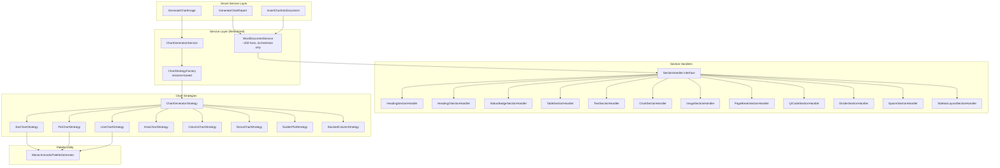

# Design Document: ChartGenie Refactoring

## Overview

This design covers six refactoring initiatives for the ChartGenie Appian plugin, aimed at improving testability, maintainability, and correctness. The changes are intentionally scoped to preserve existing runtime behaviour while restructuring internals.

**Key Research Findings:**

- `WordDocumentService` is ~895 lines with a `processSection` switch handling 13 distinct section types (HEADING, HEADING2, STATUS_BADGE, REPORT_TABLE, TEXT, RICH_TEXT, PARAGRAPH, SIDEBAR_LAYOUT, PAGE_BREAK, CHART, QR_CODE, IMAGE, DIVIDER, SPACER plus a default handler).
- Chart strategies (`BarChartStrategy`, `PieChartStrategy`, etc.) contain hard-coded `BIA_PALETTE` / `BARCLAYS_BLUES` colour arrays referencing a specific client.
- `ChartStrategyFactory.getStrategy()` is fully static with a private constructor — needs conversion to an instance method for testability.
- `appian-plugin.xml` carries both a `version="1.0.0"` attribute on `<appian-plugin>` and a `<version>1.3.1</version>` element inside `<plugin-info>`, creating ambiguity.
- The build.gradle `version` block already reads from `<plugin-info><version>` via XmlSlurper.
- 10 manual test runners exist as `public static void main` classes with corresponding `JavaExec` task registrations in build.gradle.
- Word temp files (`~$*.docx`) are currently tracked in the test directory despite `.gitignore` already having `~$*` — the pattern is likely being overridden by tracked status.

## Architecture

The refactoring is structured as six independent work streams that can be applied in any order, though Requirement 6 (DI) depends logically on Requirement 4 (decomposition) being complete first.



## Components and Interfaces

### 1. Test Conversion (Requirement 1)

Each existing manual test runner is converted to a JUnit 5 test class:

| Current Runner | Converted Test Class | Key Behaviour |
|---|---|---|
| `AllChartTypesTest` | `AllChartTypesTest` (refactored) | Generates all 8 chart types, asserts non-null |
| `SecurityRegressionTest` | `SecurityRegressionTest` (refactored) | Security-sensitive payload, template-dependent |
| `ScatterPlotUnitTest` | `ScatterPlotUnitTest` (refactored) | Scatter chart generation |
| `LocalRunner` | `LocalRunnerTest` | Full report generation from template |
| `BiaLocalRunner` | `BiaLocalRunnerTest` | BIA-specific payload |
| `AllComponentsLocalRunner` | `AllComponentsLocalRunnerTest` | All section types |
| `NestedTablesLocalRunner` | `NestedTablesLocalRunnerTest` | Nested table rendering |
| `HtmlMarkupLocalRunner` | `HtmlMarkupLocalRunnerTest` | HTML rich text sections |
| `ScatterPlotTestRunner` | `ScatterPlotTestRunnerTest` | Scatter with custom config |
| `JsonRunner` | `JsonRunnerTest` | JSON payload parsing |

**Pattern for template-dependent tests:**

```java
@Test
void generateReport_withTemplate() throws Exception {
    Path template = Path.of("src/test/java/com/appiancs/plugins/chartgenie/template.docx");
    Assumptions.assumeTrue(Files.exists(template),
        "Template not available in CI environment");
    // ... test logic
    assertNotNull(result);
}
```

**Pattern for standalone tests (no external files needed):**

```java
@Test
void allChartTypes_generateSuccessfully() {
    for (String chartType : CHART_TYPES) {
        ChartGeneratorStrategy strategy = ChartStrategyFactory.getStrategy(chartType);
        JFreeChart chart = strategy.generate(createTestConfig(chartType));
        assertNotNull(chart, "Chart should not be null for type: " + chartType);
    }
}
```

### 2. Monochromatic Palette Generator (Requirement 2)

**New class:** `com.appiancs.plugins.chartgenie.service.MonochromaticPaletteGenerator`

```java
public final class MonochromaticPaletteGenerator {

    private static final Paint[] DEFAULT_GRAYSCALE_PALETTE = { /* 6+ shades */ };

    /**
     * Generates a monochromatic palette from a base colour.
     * @param hexColor 6-char hex string (with or without "#")
     * @param count number of shades to generate (minimum 6)
     * @return Paint array from darkest to lightest
     */
    public static Paint[] generate(String hexColor, int count) { ... }

    /**
     * Returns the default grayscale fallback palette.
     */
    public static Paint[] getDefaultPalette() { ... }

    /**
     * Resolves a palette from ChartConfiguration.primaryColor.
     * Returns default if input is null/empty/invalid.
     */
    public static Paint[] resolve(String primaryColor) { ... }
}
```

**Algorithm:** Convert hex to HSL, distribute lightness evenly from 20% (darkest) to 80% (lightest) across the requested shade count. Saturation and hue remain constant.

**Strategy changes:** Each strategy replaces its `BIA_PALETTE` / `BARCLAYS_BLUES` constant with:
```java
Paint[] palette = MonochromaticPaletteGenerator.resolve(config.getPrimaryColor());
```

When more colours are needed than the palette contains, the strategy cycles: `palette[index % palette.length]`.

### 3. Plugin Version Fix (Requirement 3)

**Current state:** `appian-plugin.xml` declares version in two places:
- `<appian-plugin ... version="1.0.0">` (root attribute — stale)
- `<plugin-info><version>1.3.1</version>` (correct, authoritative)

**Change:** Remove the `version` attribute from the root `<appian-plugin>` element. The build.gradle already resolves from `<plugin-info><version>` which is correct. The JAR manifest `Implementation-Version` will match.

### 4. Section Handler Decomposition (Requirement 4)

**Interface:**

```java
public interface SectionHandler {
    /**
     * Renders a section into the document or cell context.
     *
     * @param context rendering context containing doc, cell, and layout params
     * @param section the section data to render
     */
    void render(SectionRenderContext context, ReportSection section) throws Exception;
}
```

**Context object:**

```java
public class SectionRenderContext {
    private final XWPFDocument document;
    private final XWPFTableCell cell;       // null if rendering to document body
    private final int availableWidthTwips;
    private final boolean isSidebar;
    // constructor, getters
}
```

**Registry / Dispatcher (inside WordDocumentService):**

```java
private final Map<String, SectionHandler> handlers = Map.ofEntries(
    Map.entry("HEADING", new HeadingSectionHandler()),
    Map.entry("HEADING2", new Heading2SectionHandler()),
    Map.entry("STATUS_BADGE", new StatusBadgeSectionHandler()),
    Map.entry("REPORT_TABLE", new TableSectionHandler(tableGenerator)),
    Map.entry("RICH_TEXT", new TextSectionHandler(htmlRenderer)),
    Map.entry("TEXT", new TextSectionHandler(htmlRenderer)),
    Map.entry("PARAGRAPH", new TextSectionHandler(htmlRenderer)),
    Map.entry("SIDEBAR_LAYOUT", new SidebarLayoutSectionHandler()),
    Map.entry("PAGE_BREAK", new PageBreakSectionHandler()),
    Map.entry("CHART", new ChartSectionHandler()),
    Map.entry("QR_CODE", new QrCodeSectionHandler()),
    Map.entry("IMAGE", new ImageSectionHandler()),
    Map.entry("DIVIDER", new DividerSectionHandler()),
    Map.entry("SPACER", new SpacerSectionHandler())
);
```

**Default behaviour:** Unrecognized types render section text as a plain paragraph via a `DefaultSectionHandler`.

**Package:** `com.appiancs.plugins.chartgenie.service.handlers`

### 5. Gitignore and Temp File Cleanup (Requirement 5)

The `.gitignore` already contains the `~$*` pattern. The tracked `~$*.docx` files need to be removed from the Git index:

```bash
git rm --cached "src/test/java/com/appiancs/plugins/chartgenie/~\$a-full-report-v2.docx"
git rm --cached "src/test/java/com/appiancs/plugins/chartgenie/~\$a-full-report.docx"
git rm --cached "src/test/java/com/appiancs/plugins/chartgenie/~\$l-components-report.docx"
git rm --cached "src/test/java/com/appiancs/plugins/chartgenie/~\$sted-tables-report.docx"
```

### 6. Constructor-Based Dependency Injection (Requirement 6)

**WordDocumentService refactored constructors:**

```java
public class WordDocumentService {
    private final HtmlRichTextRenderer htmlRenderer;
    private final TableGenerator tableGenerator;
    private final TemplateVariableSubstitutor substitutor;

    /** Production no-arg constructor — preserves existing behaviour. */
    public WordDocumentService() {
        this(new HtmlRichTextRenderer(), new TableGenerator(), new TemplateVariableSubstitutor());
    }

    /** Parameterized constructor for testing. */
    public WordDocumentService(HtmlRichTextRenderer htmlRenderer,
                               TableGenerator tableGenerator,
                               TemplateVariableSubstitutor substitutor) {
        if (htmlRenderer == null) throw new IllegalArgumentException("htmlRenderer must not be null");
        if (tableGenerator == null) throw new IllegalArgumentException("tableGenerator must not be null");
        if (substitutor == null) throw new IllegalArgumentException("substitutor must not be null");
        this.htmlRenderer = htmlRenderer;
        this.tableGenerator = tableGenerator;
        this.substitutor = substitutor;
    }
}
```

**ChartGenerationService refactored:**

```java
public class ChartGenerationService {
    private final ChartStrategyFactory strategyFactory;

    public ChartGenerationService() {
        this(new ChartStrategyFactory());
    }

    public ChartGenerationService(ChartStrategyFactory strategyFactory) {
        if (strategyFactory == null) throw new IllegalArgumentException("strategyFactory must not be null");
        this.strategyFactory = strategyFactory;
    }
}
```

**ChartStrategyFactory conversion:** Remove `private` constructor and `throw`, convert `getStrategy` from `static` to instance method. The factory becomes instantiable.

## Data Models

No new persistent data models are introduced. The existing DTOs (`ChartConfiguration`, `ReportSection`, `ReportRequest`, `ReportSettings`) remain unchanged.

**New value objects:**

| Class | Purpose |
|---|---|
| `SectionRenderContext` | Immutable context passed to section handlers containing document, cell, width, and sidebar flag |

**Configuration change:**

| File | Change |
|---|---|
| `appian-plugin.xml` | Remove `version` attribute from root element |
| `.gitignore` | Already correct — no change needed |
| `build.gradle` | Remove 10 `JavaExec` runner task registrations |


## Correctness Properties

*A property is a characteristic or behavior that should hold true across all valid executions of a system — essentially, a formal statement about what the system should do. Properties serve as the bridge between human-readable specifications and machine-verifiable correctness guarantees.*

### Property 1: Monochromatic Palette Generation Invariants

*For any* valid 6-character hexadecimal colour string (with or without leading "#"), the `MonochromaticPaletteGenerator.resolve()` function SHALL return a `Paint[]` of at least 6 elements where all colours share the same hue (within floating-point tolerance) and lightness values are ordered from darkest to lightest.

**Validates: Requirements 2.2**

### Property 2: Invalid Colour Fallback Consistency

*For any* input that is null, empty, composed entirely of whitespace, or not a valid 6-character hexadecimal string, `MonochromaticPaletteGenerator.resolve()` SHALL return a palette identical (by reference or element equality) to `MonochromaticPaletteGenerator.getDefaultPalette()`.

**Validates: Requirements 2.3**

### Property 3: Palette Colour Cycling

*For any* generated palette of size N and any requested colour index I where I ≥ N, the colour returned SHALL equal `palette[I % N]` — ensuring no `ArrayIndexOutOfBoundsException` occurs regardless of how many series the chart contains.

**Validates: Requirements 2.6**

### Property 4: Section Handler Dispatch Correctness

*For any* section type string in the set of known types {HEADING, HEADING2, STATUS_BADGE, REPORT_TABLE, TEXT, RICH_TEXT, PARAGRAPH, SIDEBAR_LAYOUT, PAGE_BREAK, CHART, QR_CODE, IMAGE, DIVIDER, SPACER}, the `WordDocumentService` SHALL invoke the registered handler for that type exactly once when processing a `ReportSection` with that type.

**Validates: Requirements 4.2**

### Property 5: Refactoring Output Equivalence

*For any* valid combination of `ReportSection` list, `ReportSettings`, and template file, the byte array produced by the refactored `WordDocumentService` (with section handlers) SHALL be byte-for-byte identical to the output produced by the original monolithic implementation for the same inputs.

**Validates: Requirements 4.6**

### Property 6: Unknown Section Type Default Rendering

*For any* string that does not match a known section type (case-insensitive), when processed as a `ReportSection.type`, the `WordDocumentService` SHALL render the section's text content as a plain paragraph without throwing an exception.

**Validates: Requirements 4.7**

### Property 7: Null Dependency Rejection

*For any* service class with a parameterized constructor (`WordDocumentService` or `ChartGenerationService`), and *for any* single constructor parameter set to null while all others are valid non-null instances, the constructor SHALL throw an `IllegalArgumentException` whose message contains the name of the null parameter.

**Validates: Requirements 6.6**

## Error Handling

| Scenario | Component | Behaviour |
|---|---|---|
| `primaryColor` is null/empty/invalid | `MonochromaticPaletteGenerator` | Returns default grayscale palette; logs a warning |
| Unknown chart type string | `ChartStrategyFactory` | Returns `BarChartStrategy` as default; logs a warning |
| Unknown section type string | `WordDocumentService` / `DefaultSectionHandler` | Renders section text as plain paragraph; no exception |
| Template file does not exist | Converted JUnit tests | `Assumptions.assumeTrue()` skips the test gracefully |
| Null constructor dependency | `WordDocumentService`, `ChartGenerationService` | Throws `IllegalArgumentException` with parameter name |
| Chart generation returns null | `ChartGenerationService` | Throws `IllegalStateException` (existing behaviour preserved) |
| Section handler throws exception | `WordDocumentService` | Propagates exception to caller (existing behaviour preserved) |
| Palette colour index exceeds palette length | Strategy implementations | Cycles via modulo — no exception |

## Testing Strategy

### Test Framework

- **Unit & Property Testing:** JUnit 5 (Jupiter) — already configured in build.gradle with `useJUnitPlatform()`
- **Property-Based Testing:** [jqwik](https://jqwik.net/) — the standard PBT library for JUnit 5 on the JVM
- **Mocking:** Mockito (for DI verification tests)

### Dependency Addition

```gradle
testImplementation 'net.jqwik:jqwik:1.9.1'
testImplementation 'org.mockito:mockito-core:5.14.2'
```

### Test Categories

**Property-Based Tests (jqwik):**
- Each correctness property above maps to a single `@Property` test method
- Minimum 100 iterations per property (jqwik default is 1000, which is fine)
- Each test is tagged with a comment: `// Feature: chartgenie-refactoring, Property N: <title>`

**Example-Based Unit Tests:**
- Converted runners (10 classes) → JUnit 5 `@Test` methods
- DI injection with mocks → verify mock interactions
- Strategy source scanning → verify no hardcoded palettes
- Plugin XML structure → verify single version element

**Integration Tests:**
- `./gradlew clean test` → zero failures
- JAR manifest → correct `Implementation-Version`

**Smoke Tests:**
- .gitignore pattern present
- No ~$*.docx in git index
- WordDocumentService < 300 non-blank, non-import lines

### Property Test Configuration

- Library: jqwik 1.9.1
- Minimum iterations: 100 per property
- Tag format: `// Feature: chartgenie-refactoring, Property {number}: {title}`
- Each property-based test implements exactly one correctness property from this document

### Test Organization

```
src/test/java/com/appiancs/plugins/chartgenie/
├── AllChartTypesTest.java          (converted, @Test)
├── SecurityRegressionTest.java     (converted, @Test)
├── ScatterPlotUnitTest.java        (converted, @Test)
├── LocalRunnerTest.java            (new, replaces LocalRunner)
├── BiaLocalRunnerTest.java         (new, replaces BiaLocalRunner)
├── AllComponentsLocalRunnerTest.java (new)
├── NestedTablesLocalRunnerTest.java  (new)
├── HtmlMarkupLocalRunnerTest.java    (new)
├── ScatterPlotTestRunnerTest.java    (new)
├── JsonRunnerTest.java               (new)
├── properties/
│   ├── PaletteGeneratorPropertyTest.java   (Properties 1, 2, 3)
│   ├── SectionHandlerPropertyTest.java     (Properties 4, 5, 6)
│   └── DependencyInjectionPropertyTest.java (Property 7)
└── unit/
    ├── MonochromaticPaletteGeneratorTest.java
    ├── ChartStrategyFactoryTest.java
    └── WordDocumentServiceDITest.java
```
